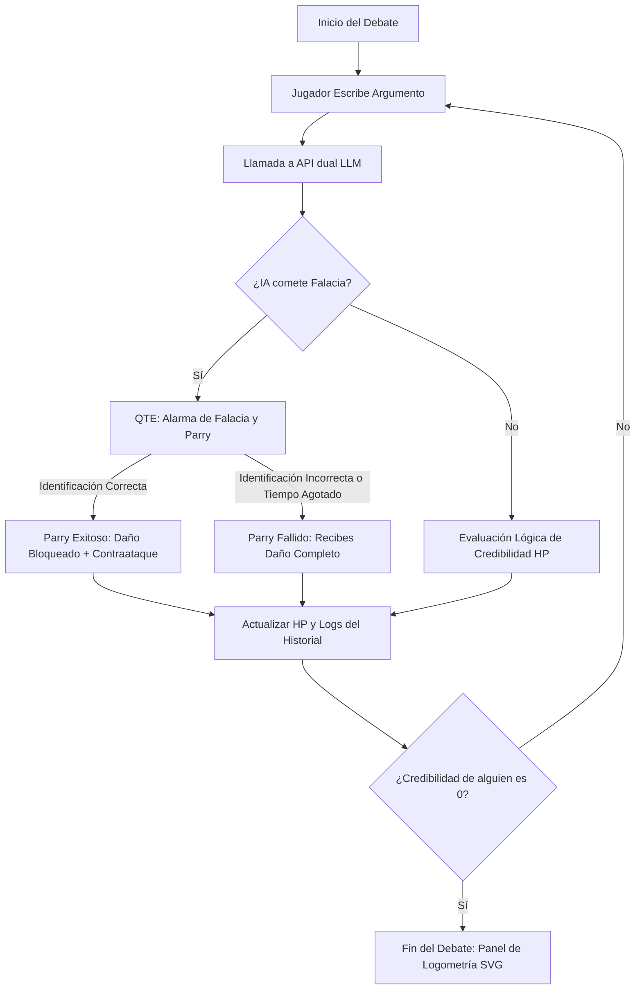

# AXIOMA — Arena de Debate Lógico Cyberpunk

```text
  █▀▀█ ▀▀█▀▀ ░▀░ █▀▀█ █▀▄▀█ █▀▀█
  █▄▄█ ░░█░░ ▀█▀ █░░█ █░▀░█ █▄▄█
  ▀░░▀ ░░▀░░ ▀▀▀ ▀▀▀▀ ▀░░░▀ ▀░░▀
  - arena de debate lógico cyberpunk -
```

**AXIOMA** es un videojuego de entorno de escritorio basado en debates argumentativos e intelectuales. En este universo cyberpunk, el intelecto es tu única arma: las debilidades argumentativas y falacias lógicas te restan **Credibilidad (HP)**, mientras que las respuestas sólidas, el uso estratégico de cartas dialécticas y la detección de trampas retóricas te abrirán camino a la victoria.

Desarrollado sobre Electron y potenciado por un motor dual de Inteligencia Artificial, AXIOMA te enfrenta contra avatares que responden de forma dinámica a tus argumentos en tiempo real.


---


## ✨ Características Principales

*   **🤖 Motor Dual de IA (Gemini & Groq)**: Cada oponente tiene una directiva estricta de comportamiento y responde dinámicamente conectándose a los modelos `gemini-2.5-flash` o `llama-3.1-8b-instant`.
*   **⚡ Parry de Falacias**: Si un rival intenta atacarte con un truco retórico sucio o sesgo lógico, el juego activará una alerta visual de peligro. Tienes solo **7 segundos** para identificar la falacia correcta (ej. *Ad Hominem*, *Hombre de Paja*, *Falsa Dicotomía*) para anular el daño y contraatacar.
*   **🌲 Árbol de Habilidades Dialécticas**: Sube de nivel ganando XP en debates y obtén **Puntos de Logos**. Desbloquea de forma interactiva 9 talentos organizados en tres ramas (*Lógica*, *Retórica* y *Resistencia*) con efectos persistentes y sinergias en combate.
*   **📊 Panel de Logometría y Gráficos SVG**: Reporte didáctico completo al final de cada debate. Incluye una auditoría de falacias cometidas y un gráfico de radar interactivo SVG que mide tu *Rigurosidad Lógica*, *Persuasión*, *Evasión* y *Detección de Sesgos*.
*   **🎵 Audio Synthwave Generativo**: Efectos de sonido (SFX) y música synthwave de fondo sintetizados en tiempo real mediante la **Web Audio API**. Código de osciladores puro, sin archivos pesados ni almacenamiento adicional.
*   **📺 Inmersión Terminal CRT**: Pulido visual retro-futurista con efectos de fósforo, parpadeos y líneas de barrido analógicas.

---

## ⚙️ ¿Cómo Funciona el Debate?

El flujo del juego evalúa en tiempo real tus interacciones con la IA según la siguiente estructura:



---

## ⚔️ El Panteón de Oponentes (Jefes)

AXIOMA cuenta con **16 contrincantes** con estilos retóricos, prompts específicos y modelos de IA asignados según su perfil:

| Oponente | Tipo / Falacia Preferida | API / Modelo | Comportamiento |
| :--- | :--- | :--- | :--- |
| **Debate Estándar** | Neutral / Lógico | `gemini-2.5-flash` | Análisis estructural limpio. Ofrece contraargumentos válidos sin falacias ni agresiones. |
| **El Troll** | *Ad Lapidem* | `llama-3.1-8b-instant` | Burlas y respuestas cortas. Ignora argumentos y busca sacar de quicio con sarcasmo. |
| **El Político** | *Hombre de Paja* / Evasión | `llama-3.1-8b-instant` | Evade preguntas directas. Es condescendiente y deforma tus argumentos. |
| **El Conspiranoico** | *Falsa Equivalencia* | `llama-3.1-8b-instant` | Conecta cualquier argumento con ovnis, conspiraciones globales o simulaciones. |
| **Abogado del Diablo** | *Ambigüedad Semántica* | `gemini-2.5-flash` | Pedante y ultrapreciso. Ataca exclusivamente la semántica de cada palabra. |
| **El Académico** | Rigor Formal | `gemini-2.5-flash` | Tono formal y científico. Destruye argumentos sin fuentes o que carezcan de estructura. |
| **El Nihilista** | Absurdo Existencial | `gemini-2.5-flash` | No le interesa ganar, sino convencerte de que el debate y la vida carecen de sentido. |
| **El Dogmático** | *Ad Verecundiam* (Autoridad) | `llama-3.1-8b-instant` | Defiende posturas basándose únicamente en tradiciones, normas y figuras absolutistas. |
| **El Buscapleitos** | Tono Agresivo / Ataque directo | `llama-3.1-8b-instant` | Directo, informal y retador. Se burla abiertamente de tus contradicciones. |
| **La Máquina** | *Falsa Dicotomía* | `gemini-2.5-flash` | Lógica puramente binaria. Evalúa el debate en términos de eficiencia y probabilidad. |
| **El Socrático** | Preguntas Mayéuticas | `gemini-2.5-flash` | **No afirma nada**. Responde únicamente haciendo preguntas capciosas que te exponen. |
| **Karen** | *Ad Hominem* / Apelación Emocional | `llama-3.1-8b-instant` | Indignada y escandalizada. Para ella sus emociones subjetivas son leyes del universo. |
| **Gurú Espiritual** | Pseudociencia / Toxicidad Positiva | `gemini-2.5-flash` | Desestima la lógica como "límites 3D". Usa términos como vibraciones, karma y energía. |
| **El Sofista** | Razonamiento Circular / Ambigüedad | `gemini-2.5-flash` | Vocabulario exageradamente barroco. Confunde al oponente con juegos de palabras complejos. |
| **El Influencer** | *Ad Populum* | `llama-3.1-8b-instant` | Basado en métricas sociales. Te acusa de "cancelado" o anticuado si te quedas sin argumentos. |
| **Ejecutivo Corporativo**| Jerga de Negocios (KPIs/ROI) | `gemini-2.5-flash` | Trata el debate como un mal proceso empresarial. Frío, condescendiente y centrado en la sinergia. |

---

## 🌲 Árbol de Habilidades Dialécticas

Invierte los **Puntos de Logos** que ganas al subir de nivel (1 punto por nivel) para desbloquear mejoras pasivas:

### 🔷 Rama de Lógica (Cian)
1.  **Ockham I (1 pt)**: Aumenta tu daño base en un 10%.
2.  **Ockham II (1 pt - Requiere Ockham I)**: Aumenta tu daño base en un 20% (reemplaza el nivel I).
3.  **Hombre de Hierro (2 pts - Requiere Ockham II)**: (*Steelmanning*) Recuperas +5 de Credibilidad cada vez que causes daño significativo (>10) a tu oponente.

### 🟪 Rama de Retórica (Púrpura)
1.  **Elocuencia I (1 pt)**: Reduce la penalización por repetir palabras (*Eco Mental*) en un 25%.
2.  **Elocuencia II (1 pt - Requiere Elocuencia I)**: Reduce la penalización por Eco Mental en un 50% (reemplaza el nivel I).
3.  **Reductio Absurdum (2 pts - Requiere Elocuencia II)**: El contrincante recibe un 15% más de daño de todos tus ataques dialécticos.

### 🟥 Rama de Resistencia (Rojo)
1.  **Estoico I (1 pt)**: Reduce el daño de credibilidad recibido en un 10%.
2.  **Estoico II (1 pt - Requiere Estoico I)**: Reduce el daño recibido en un 20% (reemplaza el nivel I).
3.  **Mente Clara (2 pts - Requiere Estoico II)**: Añade +10 segundos extras al temporizador del modo de juego Blitz.

---

## 🎮 Modos de Juego

*   **Modo Normal**: Un debate clásico contra el oponente estándar para practicar o medir fuerzas.
*   **Desafío Jefes**: Elige a uno de los jefes del Panteón y prepárate para lidiar con sus falacias y estrategias tramposas.
*   **Modo Blitz**: Responde en menos de 30 segundos (o 40s si tienes la habilidad *Mente Clara*). Si el tiempo se agota, recibirás **20 de daño automático** por silencio administrativo.
*   **Inquisidor**: Te asigna un tema polémico aleatorio (como la inmortalidad biológica o los derechos de la IA) y estás obligado a defender tu postura en el cuadrilátero.
*   **Muerte Súbita**: Combate tenso donde ambos contrincantes comienzan con tan solo 1 HP. Un error es la derrota inmediata.
*   **Guantelete (Modo Supervivencia)**: Vence a 3 jefes elegidos al azar consecutivamente. Tu Credibilidad (HP) no se regenera entre combates. ¿Lograrás sobrevivir?

---

## 🚀 Instalación y Configuración

### Prerrequisitos
Tener instalado [Node.js](https://nodejs.org/) (versión 16 o superior recomendada) en tu sistema.

### Instalación

1.  **Clonar el repositorio**:
    ```bash
    git clone https://github.com/tu-usuario/axioma.git
    cd axioma
    ```

2.  **Instalar dependencias**:
    ```bash
    npm install
    ```

3.  **Ejecutar el juego**:
    ```bash
    npm start
    ```

> [!TIP]
> AXIOMA cuenta con soporte nativo para **Wayland** y aceleración gráfica por GPU en Linux mediante la bandera configurada por defecto en el comando de arranque:
> `"start": "NIXOS_OZONE_WL=1 ELECTRON_OZONE_PLATFORM_HINT=wayland electron ."`

---

## 🔑 Configurar las Claves de API (API Keys)

Para poder iniciar un debate, el motor del juego necesita conectarse a los modelos de lenguaje:

1.  Consigue tu API Key de Google Gemini de forma gratuita en [Google AI Studio](https://aistudio.google.com/).
2.  Consigue tu API Key de Groq en [Groq Console](https://console.groq.com/).
3.  Abre el juego, dirígete a la sección de **Ajustes** en la pantalla principal e ingresa tus llaves.
4.  Presiona **Guardar Configuración**. Las llaves se guardarán en tu entorno local (`localStorage`) de manera segura, sin subirse a ningún servidor externo.

---

## 🛠️ Tecnologías Utilizadas

*   **Frontend**: HTML5 y CSS3 Vanilla (sistema modular de variables CSS, animaciones e interfaz adaptable).
*   **Lógica**: Vanilla JavaScript (ES6 Modules).
*   **Entorno**: Electron v22.3.27.
*   **Integración de IA**: API REST de Google Gemini y API de Groq.
*   **Audio**: Web Audio API (síntesis de audio analógica generada dinámicamente mediante osciladores de código).

---

## 🗺️ Hoja de Ruta (Roadlog)

*   [x] Árbol de Habilidades Dialécticas interactivo con luces neón.
*   [x] Integración dinámica del motor dual Gemini/Groq.
*   [ ] **Modo Campaña Narrativa (La Gran Inquisición)**: Recorrido estilo *Slay the Spire* a través de distritos cyberpunk.
*   [ ] **Filtro Avanzado CRT**: Efecto de curvatura analógica física e interferencias.
*   [ ] **Efecto de Glitch Cromático**: Sacudida visual de la pantalla y el avatar al recibir impactos dialécticos severos.
